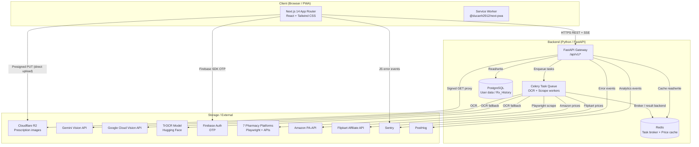
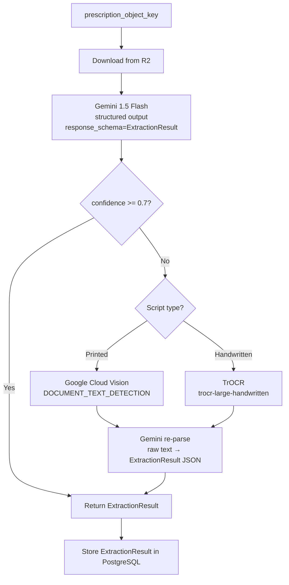

# Design Document — MedCompare MVP

## Overview

MedCompare is an Indian-market Progressive Web App (PWA) that lets patients photograph or upload a prescription, automatically extract medicine names through an AI/OCR pipeline, and compare prices across seven major Indian online pharmacies in real time. The product never processes transactions — it is a pure price-comparison and deep-link referral tool.

### Design Goals

- **20-day MVP delivery** — the architecture must favour simplicity and proven libraries over novelty.
- **Mobile-first PWA** — installable on Android/iOS, offline shell cached by a service worker, 70+ Lighthouse score.
- **Async-heavy backend** — OCR and scraping are slow; all heavy work runs in Celery workers so the HTTP API stays responsive.
- **Privacy by design** — prescription images are encrypted at rest, served only via time-limited signed URLs, and never forwarded to pharmacies.
- **Schedule H/H1 compliance** — every price lookup is gated behind a valid prescription upload; no anonymous medicine-search path exists.

### Key Research Findings

- **Gemini Vision structured output**: The Gemini 1.5 Flash API supports a `response_mime_type: application/json` + `response_schema` parameter that constrains output to a caller-defined JSON schema, eliminating hallucinated field names ([Google AI Docs](https://ai.google.dev/gemini-api/docs/structured-output)).
- **Playwright + residential proxies**: Anti-bot evasion for Indian pharmacy sites requires per-session residential proxy rotation, randomised viewport/user-agent headers, and human-like interaction delays. The `playwright-stealth` plugin patches browser fingerprints detectable by Cloudflare/DataDome.
- **Next.js 14 PWA**: `@ducanh2912/next-pwa` wraps Workbox for App Router compatibility, enabling stale-while-revalidate caching of the app shell and static assets.
- **Cloudflare R2 presigned URLs**: R2 is S3-compatible; `boto3.generate_presigned_url('get_object', ExpiresIn=N)` with the R2 endpoint generates HMAC-signed time-limited URLs that never expose the raw bucket path.
- **Celery + Redis**: FastAPI submits scrape/OCR tasks as Celery jobs; workers pull from Redis queues. The result backend is also Redis, allowing the API to poll `AsyncResult.state` and stream partial results to the frontend via SSE.


---

## Architecture

### High-Level System Diagram



### Deployment Topology (MVP)

| Component | Platform | Notes |
|-----------|----------|-------|
| Next.js PWA | Vercel | Edge-cached static assets; serverless API routes for BFF thin layer only |
| FastAPI + Celery | Railway / Render | 2 × web containers (API), 4 × worker containers (Celery) |
| PostgreSQL | Railway managed Postgres | |
| Redis | Railway managed Redis | |
| Cloudflare R2 | Cloudflare | `prescriptions` bucket, server-side AES-256 encryption |
| TrOCR | Railway worker (GPU optional) | Hugging Face `microsoft/trocr-large-handwritten` loaded at worker start |


---

## Components and Interfaces

### 1. Next.js 14 PWA Frontend

**Technology**: Next.js 14 App Router, React 18, Tailwind CSS, `@ducanh2912/next-pwa`, Firebase JS SDK v10

**Key pages / routes**:

| Route | Purpose |
|-------|---------|
| `/` | Landing / home screen |
| `/upload` | Prescription capture (camera + file picker) |
| `/review` | Extraction_Result review form |
| `/compare/[sessionId]` | Comparison_Table (per Drug_Entry tabs) |
| `/history` | Rx_History list |
| `/history/[rxId]` | Individual Rx detail + re-compare |
| `/profiles` | Family_Profile management |
| `/reminders` | Active reminders list |
| `/auth/login` | OTP login/registration |
| `/settings` | Account, delete account |

**PWA configuration**:
- `manifest.json`: `display: standalone`, `theme_color: #1A6B4A` (brand green), 192×192 and 512×512 icons
- Service worker strategy: `StaleWhileRevalidate` for app shell; `NetworkFirst` with 3 s timeout for API routes; `CacheFirst` for static assets
- Install prompt: `beforeinstallprompt` event captured and deferred; shown after the user completes their first comparison

**State management**: React Context for session state (current profile, auth token); TanStack Query v5 for server state (Rx_History, Price_Records, task polling)

### 2. FastAPI Backend Gateway

**Technology**: Python 3.12, FastAPI 0.111, SQLAlchemy 2 (async), asyncpg, redis-py (async), Pydantic v2

**Base URL**: `/api/v1`

**Authentication**: Firebase ID token verified via `firebase-admin` SDK; extracted in a FastAPI dependency. All routes except `POST /auth/verify-otp` require a valid token.

**Core endpoints**:

```
POST   /prescriptions/upload-url    → returns a presigned R2 PUT URL + object_key
POST   /prescriptions               → registers the uploaded object, enqueues OCR task → { task_id }
GET    /tasks/{task_id}             → SSE stream: task status updates → ExtractionResult on completion
POST   /compare                     → enqueues scrape tasks for all Drug_Entries → { session_id, task_ids[] }
GET    /compare/{session_id}        → SSE stream: per-platform PriceRecord updates
GET    /compare/{session_id}/result → final ComparisonResult JSON
GET    /rx-history                  → paginated list of RxHistory entries for authenticated user
GET    /rx-history/{rx_id}         → single RxHistory entry with saved PriceRecords
DELETE /rx-history/{rx_id}         → removes entry from DB + R2
GET    /rx-history/{rx_id}/image   → generates time-limited signed proxy URL (300 s TTL)
GET    /profiles                    → list Family_Profiles for authenticated user
POST   /profiles                    → create Family_Profile
PATCH  /profiles/{profile_id}      → rename profile
DELETE /profiles/{profile_id}      → delete non-primary profile + cascade
POST   /reminders                   → create Reminder
PATCH  /reminders/{reminder_id}    → edit Reminder
DELETE /reminders/{reminder_id}    → deactivate Reminder
POST   /account/delete              → initiate account purge (async, 30-day window)
```

**Rate limiting**: `slowapi` (token-bucket, 60 req/min per user for compare endpoints; 429 when task queue depth > 50)

**CORS**: Origin whitelist: Vercel preview + production domains only

### 3. OCR Pipeline Service

**Technology**: Python, Celery worker pool (queue: `ocr`), Google Generative AI SDK, `google-cloud-vision`, `transformers` (TrOCR)

**Pipeline flow**:



**Gemini prompt strategy**: The system prompt instructs the model to output only valid JSON conforming to the `ExtractionResult` schema. The `response_schema` parameter enforces this at the API level, eliminating free-text hallucinations.

**Script classification** (when confidence < 0.7): A secondary Gemini call with a lightweight prompt classifies the image as "printed" or "handwritten" before dispatching to the correct fallback engine.

**PDF handling**: `pypdfium2` renders the first page of a PDF to a 300 DPI PNG before OCR; the original PDF is stored in R2 unmodified.

### 4. Drug Normalizer Service

**Technology**: Python module, used synchronously in Celery `ocr` workers and in the FastAPI request path (for manual re-runs)

**Drug_DB composition**:
- OpenFDA drug label data (NDC → generic salt mapping)
- Indian Drug Index (CDSCO brand → salt CSV)
- MedCompare curated dataset (100 k+ Indian brand name → salt mappings, loaded into PostgreSQL `drug_brands` table)

**Matching algorithm**:
1. Exact lookup (case-insensitive, PostgreSQL `ILIKE`) — O(log n) index scan
2. OCR substitution normalisation: apply character substitutions (`0→O`, `1→l`, `l→I`, `5→S`, `8→B`) to candidate string before lookup
3. Fuzzy match: PostgreSQL `pg_trgm` trigram index with `similarity()` threshold; candidates with edit distance ≤ 2 accepted
4. Return `Canonical_Drug` + all brand variants of matching salt+strength

**No-match path**: Returns `{ matched: false, raw_name: "..." }` → API returns 422 with `DRUG_NOT_FOUND` code → frontend prompts user to correct

### 5. Scraping Engine

**Technology**: Python, Celery worker pool (queue: `scrape`), Playwright (async API), `playwright-stealth`, residential proxy pool (BrightData/Oxylabs), `httpx` for API calls

**Per-platform strategy**:

| Platform | Method | Notes |
|----------|--------|-------|
| 1mg | Playwright + proxy | JavaScript-heavy SPA; wait for `.price-box` selector |
| PharmEasy | Playwright + proxy | GraphQL API discoverable from network tab; prefer JSON endpoint |
| Netmeds | Playwright + proxy | Standard product search URL pattern |
| Apollo 24/7 | Playwright + proxy | Requires cookie consent; stealth plugin handles fingerprint |
| MedPlus | Playwright + proxy | Static-ish HTML; faster than SPA-based peers |
| Amazon Pharmacy | Amazon PA-API v5 | `SearchItems` with `Keywords=<canonical_drug>`, `SearchIndex=HealthPersonalCare` |
| Flipkart Health+ | Flipkart Affiliate API | Product search endpoint with `q=<canonical_drug>` |

**Scrape task lifecycle**:
1. API receives compare request → creates `CompareSession` in DB → enqueues one `scrape_platform` Celery task per platform per Drug_Entry (7 × n tasks for n drugs)
2. Each task: check Redis cache (`prices:{canonical_drug_id}:{platform_id}`) → if HIT return cached record; if MISS run scraper → store result in Redis (TTL 1800 s) + PostgreSQL `price_records` table → publish update to Redis Pub/Sub channel `session:{session_id}`
3. API SSE handler subscribes to channel, streams `{ platform_id, status, price_record }` events to the browser
4. 45 s global timeout enforced by Celery task soft time limit; timed-out tasks publish `{ platform_id, status: "timeout" }`

**Anti-bot measures**: Per-request proxy rotation, randomised 200–800 ms delays between page interactions, stealth plugin (disables `navigator.webdriver`, patches `chrome` object), randomised viewport sizes (360×780 to 414×896)

**Retry policy**: 3 retries with 5 s exponential backoff; after 3 failures, mark platform unavailable for session and log to Sentry


### 6. Comparison View Logic

**Discount calculation** (pure function, frontend + backend):
```
discount_pct = round((mrp_inr - selling_price_inr) / mrp_inr * 100, 1)
```

**Default sort comparator** for `PriceRecord[]`:
```python
def default_sort_key(record):
    # Primary: out-of-stock sorts last
    # Secondary: selling_price ascending (None last)
    # Tertiary: delivery_eta ascending (None last)
    in_stock = 0 if record.in_stock else 1
    price = record.selling_price_inr if record.selling_price_inr is not None else float('inf')
    eta = record.delivery_eta_hours if record.delivery_eta_hours is not None else float('inf')
    return (in_stock, price, eta)
```

**Combined total**: `sum(min(r.selling_price_inr for r in records if r.in_stock and r.selling_price_inr) for records in per_drug_record_groups)` — Drug_Entries with no in-stock records are excluded.

**Generic suggestions**:
- Computed at compare-result time by querying `drug_brands` for same `canonical_drug_id` (salt+strength) but different brand names
- A suggestion is included only if `min(s.selling_price for s in suggestion_records if s.in_stock) < p.selling_price` for the same platform
- Maximum 3 suggestions sorted by cheapest across all platforms

### 7. Firebase Auth Integration

**Flow**:
1. User enters 10-digit Indian mobile number → frontend calls `signInWithPhoneNumber(auth, "+91" + number, recaptchaVerifier)` → Firebase sends OTP
2. User enters 6-digit OTP → frontend calls `confirmationResult.confirm(otp)` → Firebase returns ID token
3. Frontend sends ID token to `POST /api/v1/auth/session` → backend verifies with `firebase_admin.auth.verify_id_token()` → creates `users` DB record if new → returns session cookie (30-day HttpOnly Secure SameSite=Strict)
4. All subsequent API calls include the session cookie; backend middleware verifies on each request

**OTP lockout**: The 3-attempt lockout per number is enforced by Firebase Auth natively (Firebase blocks the phone number after N failed OTP attempts). The backend records attempt counts in Redis (`otp_attempts:{phone}`, TTL 600 s) as a secondary safeguard.

**Guest mode**: A Redis key `guest_compares:{session_cookie_fingerprint}` tracks the count of comparisons made without authentication. At count = 1, the next compare request returns `{ requires_auth: true }` and the frontend shows the login prompt.

### 8. Prescription Image Security

**Upload flow**:
1. Frontend requests `POST /api/v1/prescriptions/upload-url` → backend generates presigned R2 PUT URL (TTL 60 s), returns `{ upload_url, object_key }`
2. Frontend uploads directly to R2 via the presigned PUT URL — the backend never receives the file bytes
3. Frontend calls `POST /api/v1/prescriptions` with `{ object_key, profile_id }` → backend enqueues OCR

**Download / display flow**:
- Backend downloads the object directly from R2 using a service-account token (never exposed to the client)
- Client image display: `GET /api/v1/rx-history/{rx_id}/image` returns a 302 redirect to a presigned GET URL (TTL 300 s, one-time use)
- Raw R2 bucket URLs are never in API responses; CORS on the R2 bucket blocks direct browser access

**Encryption**: R2 SSE with AES-256 (Cloudflare-managed keys)


---

## Data Models

### PostgreSQL Schema

```sql
-- Users and auth
CREATE TABLE users (
    id          UUID PRIMARY KEY DEFAULT gen_random_uuid(),
    phone       VARCHAR(10) NOT NULL UNIQUE,  -- 10-digit Indian mobile number
    firebase_uid VARCHAR(128) NOT NULL UNIQUE,
    created_at  TIMESTAMPTZ NOT NULL DEFAULT now(),
    deleted_at  TIMESTAMPTZ  -- soft-delete; hard purge via scheduled job
);

-- Family profiles (primary profile created at registration)
CREATE TABLE family_profiles (
    id          UUID PRIMARY KEY DEFAULT gen_random_uuid(),
    user_id     UUID NOT NULL REFERENCES users(id) ON DELETE CASCADE,
    name        VARCHAR(50) NOT NULL,
    date_of_birth DATE,
    is_primary  BOOLEAN NOT NULL DEFAULT false,
    created_at  TIMESTAMPTZ NOT NULL DEFAULT now(),
    UNIQUE(user_id, name)
);

-- Prescriptions (uploaded files)
CREATE TABLE prescriptions (
    id          UUID PRIMARY KEY DEFAULT gen_random_uuid(),
    user_id     UUID NOT NULL REFERENCES users(id) ON DELETE CASCADE,
    profile_id  UUID NOT NULL REFERENCES family_profiles(id) ON DELETE CASCADE,
    r2_object_key VARCHAR(512) NOT NULL,
    uploaded_at TIMESTAMPTZ NOT NULL DEFAULT now()
);

-- OCR extraction results
CREATE TABLE extraction_results (
    id              UUID PRIMARY KEY DEFAULT gen_random_uuid(),
    prescription_id UUID NOT NULL REFERENCES prescriptions(id) ON DELETE CASCADE,
    drug_entries    JSONB NOT NULL,  -- DrugEntry[]
    confidence      NUMERIC(4,3),
    ocr_engine      VARCHAR(32),     -- 'gemini' | 'gcv' | 'trocr'
    created_at      TIMESTAMPTZ NOT NULL DEFAULT now()
);

-- Canonical drug database
CREATE TABLE canonical_drugs (
    id          UUID PRIMARY KEY DEFAULT gen_random_uuid(),
    salt_name   VARCHAR(256) NOT NULL,
    strength    VARCHAR(64),
    dosage_form VARCHAR(64),
    schedule    VARCHAR(8)   -- 'H' | 'H1' | null
);

CREATE TABLE drug_brands (
    id              UUID PRIMARY KEY DEFAULT gen_random_uuid(),
    canonical_drug_id UUID NOT NULL REFERENCES canonical_drugs(id),
    brand_name      VARCHAR(256) NOT NULL,
    manufacturer    VARCHAR(256),
    source          VARCHAR(32),  -- 'openfda' | 'idi' | 'curated'
    UNIQUE(canonical_drug_id, brand_name)
);
CREATE INDEX idx_drug_brands_name_trgm ON drug_brands USING GIN (brand_name gin_trgm_ops);

-- Price records (persistent store, Redis is the cache)
CREATE TABLE price_records (
    id                  UUID PRIMARY KEY DEFAULT gen_random_uuid(),
    canonical_drug_id   UUID NOT NULL REFERENCES canonical_drugs(id),
    platform_id         VARCHAR(32) NOT NULL,  -- enum: '1mg'|'pharmeasy'|...
    brand_name          VARCHAR(256),
    pack_size           VARCHAR(64),
    mrp_inr             NUMERIC(10,2),
    selling_price_inr   NUMERIC(10,2),
    in_stock            BOOLEAN NOT NULL DEFAULT false,
    delivery_eta_hours  INTEGER,
    affiliate_url       TEXT,
    scraped_at          TIMESTAMPTZ NOT NULL DEFAULT now()
);
CREATE INDEX idx_price_records_drug_platform ON price_records(canonical_drug_id, platform_id);

-- Compare sessions (links ExtractionResult to PriceRecords)
CREATE TABLE compare_sessions (
    id                  UUID PRIMARY KEY DEFAULT gen_random_uuid(),
    extraction_result_id UUID NOT NULL REFERENCES extraction_results(id),
    user_id             UUID REFERENCES users(id) ON DELETE SET NULL,
    profile_id          UUID REFERENCES family_profiles(id) ON DELETE SET NULL,
    price_record_ids    UUID[],  -- final set after session completes
    created_at          TIMESTAMPTZ NOT NULL DEFAULT now()
);

-- Rx History (view over prescriptions + extraction_results + compare_sessions)
-- Implemented as a PostgreSQL view for read convenience
CREATE VIEW rx_history AS
    SELECT
        cs.id              AS session_id,
        p.id               AS prescription_id,
        p.profile_id,
        p.r2_object_key,
        p.uploaded_at,
        er.id              AS extraction_result_id,
        er.drug_entries,
        er.created_at      AS extraction_created_at,
        cs.price_record_ids,
        cs.created_at      AS compared_at
    FROM compare_sessions cs
    JOIN extraction_results er ON er.id = cs.extraction_result_id
    JOIN prescriptions p ON p.id = er.prescription_id;

-- Reminders
CREATE TABLE reminders (
    id              UUID PRIMARY KEY DEFAULT gen_random_uuid(),
    profile_id      UUID NOT NULL REFERENCES family_profiles(id) ON DELETE CASCADE,
    drug_entry      JSONB NOT NULL,    -- snapshot of the DrugEntry
    start_time      TIME NOT NULL,     -- 24-h format HH:MM
    frequency_hours INTEGER NOT NULL,
    end_date        DATE NOT NULL,
    is_active       BOOLEAN NOT NULL DEFAULT true,
    completed_at    TIMESTAMPTZ,
    created_at      TIMESTAMPTZ NOT NULL DEFAULT now()
);
```

### Application-Level Types (Pydantic / TypeScript)

```python
# Pydantic v2 — shared between API and Celery workers
class DrugEntry(BaseModel):
    drug_name: str
    strength: Optional[str] = None
    dosage_form: Optional[str] = None
    frequency: Optional[str] = None
    duration: Optional[str] = None

class ExtractionResult(BaseModel):
    prescription_id: UUID
    drug_entries: List[DrugEntry]
    confidence: Optional[float] = None
    ocr_engine: Optional[str] = None
    created_at: datetime

class PriceRecord(BaseModel):
    id: UUID
    canonical_drug_id: UUID
    platform_id: str
    brand_name: Optional[str] = None
    pack_size: Optional[str] = None
    mrp_inr: Optional[Decimal] = None
    selling_price_inr: Optional[Decimal] = None
    in_stock: bool
    delivery_eta_hours: Optional[int] = None
    affiliate_url: Optional[HttpUrl] = None
    scraped_at: datetime

class GenericSuggestion(BaseModel):
    canonical_drug_id: UUID
    salt_name: str
    strength: Optional[str]
    brand_name: str
    min_price_inr: Decimal
    price_records: List[PriceRecord]
```

### Redis Key Conventions

| Key pattern | Value | TTL |
|-------------|-------|-----|
| `prices:{canonical_drug_id}:{platform_id}` | `PriceRecord` JSON | 1800 s (30 min) |
| `session:{session_id}` | Pub/Sub channel | N/A (ephemeral) |
| `task:{task_id}:status` | `pending\|running\|done\|failed` | 3600 s |
| `guest_compares:{fp}` | integer count | 86400 s |
| `otp_attempts:{phone}` | integer count | 600 s |
| `queue_depth` | integer (updated by Celery beat) | no TTL |


---

## Correctness Properties

*A property is a characteristic or behavior that should hold true across all valid executions of a system — essentially, a formal statement about what the system should do. Properties serve as the bridge between human-readable specifications and machine-verifiable correctness guarantees.*

---

### Property 1: File Upload Validation

*For any* (mime_type, size_bytes) pair, the upload validator SHALL accept the file if and only if `mime_type ∈ {image/jpeg, image/png, image/heic, image/webp, application/pdf}` AND `size_bytes ≤ 20 × 1024 × 1024`. For all other inputs, the validator SHALL reject with the appropriate error message.

**Validates: Requirements 1.1, 1.5, 1.6**

---

### Property 2: OCR Fallback Routing

*For any* OCR primary result with a confidence score, the pipeline SHALL route to the fallback engine if and only if `confidence < 0.7`. For confidence values ≥ 0.7, the primary result is returned directly without invoking any fallback.

**Validates: Requirements 2.2**

---

### Property 3: Extraction_Result Round-Trip

*For any* valid `ExtractionResult`, serialising it to JSON and then deserialising back SHALL produce an `ExtractionResult` where every non-null field has a value identical to the original. No field values shall be lost, truncated, or type-coerced during the round trip.

**Validates: Requirements 2.9**

---

### Property 4: Fuzzy Drug Matching with OCR Substitutions

*For any* drug name `d` that maps to a known `Canonical_Drug`, and *for any* string `d'` produced by applying any combination of the defined OCR substitutions (`0↔O`, `1↔l`, `l↔I`, `5↔S`, `8↔B`) to characters of `d` such that edit distance(`d`, `d'`) ≤ 2, the Normalizer SHALL return the same `Canonical_Drug` for `d'` as it does for `d`. Additionally, for any case variant of `d`, the Normalizer SHALL return the same `Canonical_Drug`.

*Note: This consolidates Requirements 3.3, 3.5, and 3.6 — the OCR substitution and case-insensitivity invariants together define a single equivalence class of strings that should all resolve to the same canonical drug.*

**Validates: Requirements 3.3, 3.5, 3.6**

---

### Property 5: Price Cache Round-Trip

*For any* `PriceRecord` stored in the Redis cache under key `prices:{canonical_drug_id}:{platform_id}`, retrieving the same key before TTL expiry SHALL return a record with field-for-field identical values. After the TTL of 1800 seconds has elapsed, the same key SHALL return a cache miss.

**Validates: Requirements 4.3**

---

### Property 6: Out-of-Stock Normalisation

*For any* `(canonical_drug_id, platform_id)` pair where the platform scraper receives an empty or no-result response, the produced `PriceRecord` SHALL have `in_stock = false` and `selling_price_inr = null`.

**Validates: Requirements 4.4**

---

### Property 7: Comparison Table Sort Invariant

*For any* non-empty list of `PriceRecord` objects sorted by the default comparator, the resulting order SHALL satisfy all three conditions simultaneously: (1) all in-stock records appear before all out-of-stock records; (2) among in-stock records, selling prices are non-decreasing; (3) among in-stock records with equal selling prices, delivery ETAs are non-decreasing. Records with null values in the sort column appear at the bottom of their respective sort group.

*Note: This consolidates Requirements 5.2 and 5.3 — the multi-key sort invariant covers both default and user-selected sort columns.*

**Validates: Requirements 5.2, 5.3**

---

### Property 8: Discount Calculation Correctness

*For any* `PriceRecord` where `mrp_inr > 0` and `selling_price_inr` is not null, the displayed discount percentage SHALL equal `round((mrp_inr - selling_price_inr) / mrp_inr × 100, 1)`. The computation must be exact to one decimal place, and must never produce a negative value when `selling_price_inr ≤ mrp_inr`.

**Validates: Requirements 5.1**

---

### Property 9: Combined Total Calculation

*For any* set of Drug_Entry groups (each with one or more `PriceRecord` objects), the combined total SHALL equal the sum of `min(selling_price_inr for r in group if r.in_stock and r.selling_price_inr is not None)` over all groups that have at least one in-stock record. Groups with no in-stock records SHALL be excluded from the total.

**Validates: Requirements 5.4**

---

### Property 10: Best-Price and Best-ETA Highlights

*For any* non-empty list of `PriceRecord` objects where at least one record is in stock, the green highlight (lowest price) SHALL be assigned to exactly the record(s) with the globally minimum in-stock `selling_price_inr`, and the blue highlight (fastest delivery) SHALL be assigned to exactly the record(s) with the globally minimum in-stock `delivery_eta_hours`. A record that holds both minimums SHALL receive both highlights simultaneously.

**Validates: Requirements 5.5**

---

### Property 11: Generic Suggestion Price Filter

*For any* prescribed drug `PriceRecord` set and any candidate suggestion `PriceRecord` set, the suggestion SHALL appear in the "Cheaper Alternatives" list if and only if there exists at least one platform where the suggestion's in-stock `selling_price_inr` is strictly less than the prescribed brand's in-stock `selling_price_inr` on that same platform.

**Validates: Requirements 6.3**

---

### Property 12: Signed Proxy URL Safety

*For any* R2 object key, the URL returned by the `/rx-history/{rx_id}/image` endpoint SHALL be an HTTPS URL containing a valid `X-Amz-Signature` parameter and an `X-Amz-Expires` value ≤ 300 seconds. The URL SHALL NOT contain the raw R2 bucket hostname in a form accessible to the client without the signature.

**Validates: Requirements 13.5**

---

### Property 13: Task Queue Backpressure

*For any* incoming compare request, if the current task queue depth is greater than 50 pending scraping jobs, the API SHALL return HTTP 429. For any request arriving when queue depth ≤ 50, the API SHALL not return 429 due to queue backpressure alone.

**Validates: Requirements 14.4**

---

### Property 14: OTP Lockout Invariant

*For any* mobile number, after exactly 3 consecutive incorrect OTP submissions within a single 10-minute window, any further OTP submission attempt (correct or incorrect) SHALL be rejected with a lockout response. The lockout SHALL lift after 600 seconds from the time of the 3rd failed attempt.

**Validates: Requirements 8.4**

---

### Property 15: Family Profile Name Uniqueness

*For any* user account, at all times the set of non-deleted `Family_Profile` names within that account SHALL contain no duplicates (case-sensitive comparison). Any create or rename operation that would produce a duplicate name SHALL be rejected.

**Validates: Requirements 10.2, 10.6**

---

### Property 16: Family Profile Count Cap

*For any* user account, the count of active (non-deleted) `Family_Profile` records SHALL never exceed 5. Any create operation that would cause the count to exceed 5 SHALL be rejected with a 422 response.

**Validates: Requirements 10.1, 10.5**


---

## Error Handling

### Error Response Envelope

All API errors follow a consistent JSON envelope:

```json
{
  "error": {
    "code": "DRUG_NOT_FOUND",
    "message": "We could not find a match for 'Crocin 500'. Please correct the name.",
    "request_id": "req_01HXYZ"
  }
}
```

### Error Code Catalogue

| Code | HTTP Status | Trigger | User-facing message |
|------|-------------|---------|---------------------|
| `FILE_TOO_LARGE` | 422 | Upload > 20 MB | "File size exceeds 20 MB limit. Please upload a smaller file." |
| `UNSUPPORTED_FILE_TYPE` | 422 | Unsupported MIME type | "Unsupported file type. Please upload a JPEG, PNG, HEIC, WebP, or PDF." |
| `UPLOAD_FAILED` | 502 | R2 write error | "Upload failed. Please check your connection and try again." |
| `OCR_NO_EXTRACTION` | 422 | Zero Drug_Entries extracted | "We could not read your prescription. Please try a clearer image or enter medicines manually." |
| `DRUG_NOT_FOUND` | 422 | Normalizer no-match | "We could not find a match for '[drug_name]'. Please correct the name." |
| `DRUG_DB_UNAVAILABLE` | 503 | Drug_DB service down | "The drug database is temporarily unavailable. Please try again shortly." |
| `QUEUE_BUSY` | 429 | Task queue depth > 50 | "The service is temporarily busy. Please retry in a few seconds." |
| `PLATFORM_UNAVAILABLE` | — (partial) | Platform 3× failed | Displayed inline in Comparison_Table: "Unavailable" |
| `COMPARE_TIMEOUT` | — (partial) | 45 s elapsed | Partial results returned; non-responding platforms marked "Timeout" |
| `UNAUTHENTICATED` | 401 | Missing/invalid token | Redirect to `/auth/login` |
| `PROFILE_LIMIT_REACHED` | 422 | 6th profile attempt | "You have reached the maximum of 5 family profiles." |
| `PROFILE_NAME_DUPLICATE` | 422 | Duplicate name in account | "A profile with this name already exists." |
| `OTP_LOCKED` | 429 | > 3 failed OTP attempts | "Too many attempts. Please try again in 10 minutes." |
| `PRESCRIPTION_REQUIRED` | 403 | Compare without upload | "Please upload a prescription to proceed." |
| `AUTH_REQUIRED` | 403 | 2nd guest compare | "Create an account to view more comparisons." |

### Frontend Error Handling

- All network errors are caught by TanStack Query's `onError` callback and displayed in a toast component
- Sentry `captureException` is called for all unhandled JS errors with a breadcrumb trail of the last 10 user interactions
- React Error Boundaries wrap each page to prevent full app crashes from component-level errors

### Backend Error Handling

- FastAPI exception handlers catch `HTTPException`, `RequestValidationError`, and a custom `AppError` base class
- All `5xx` responses are logged to Sentry at `ERROR` level within 5 seconds including `request_id`, path, and stack trace
- Celery task failures are retried per the platform retry policy; terminal failures emit a Sentry event with the task arguments redacted of personal data
- Circuit breaker pattern: if a platform fails > 5 consecutive times in 10 minutes, it is placed in an open circuit state and skipped for 5 minutes before re-probing


---

## Testing Strategy

### Overview

PBT is highly applicable to this feature: the system contains pure functions (discount calculation, sort comparators, cache key logic, URL generation), data transformation pipelines (OCR → ExtractionResult, PriceRecord normalisation), and invariant-bound logic (profile caps, OTP lockout). We use `hypothesis` (Python) as the PBT library and `pytest` as the test runner.

### Unit and Property-Based Tests

**PBT library**: [`hypothesis`](https://hypothesis.readthedocs.io/) — minimum 100 iterations per test (Hypothesis default: `max_examples=100`).

**Tag format for traceability**: `# Feature: medcompare-mvp, Property N: <property_text>`

Each correctness property defined above maps to a single `@given` test:

```python
# Feature: medcompare-mvp, Property 1: File Upload Validation
@given(
    mime_type=st.one_of(
        st.sampled_from(["image/jpeg","image/png","image/heic","image/webp","application/pdf"]),
        st.text(min_size=1, max_size=50)
    ),
    size_bytes=st.integers(min_value=0, max_value=100 * 1024 * 1024)
)
def test_file_upload_validation(mime_type, size_bytes): ...

# Feature: medcompare-mvp, Property 3: ExtractionResult round-trip
@given(result=st_extraction_result())   # custom Hypothesis strategy
def test_extraction_result_round_trip(result): ...

# Feature: medcompare-mvp, Property 7: Sort Invariant
@given(records=st.lists(st_price_record(), min_size=1, max_size=20))
def test_default_sort_invariant(records): ...

# Feature: medcompare-mvp, Property 8: Discount Calculation
@given(
    mrp=st.decimals(min_value=Decimal("0.01"), max_value=Decimal("100000")),
    price=st.decimals(min_value=Decimal("0"), max_value=Decimal("100000"))
)
def test_discount_calculation(mrp, price): ...
```

### Unit Test Focus Areas

Unit tests (example-based, using `pytest`) cover:

- **OCR pipeline routing**: mock Gemini returning confidence 0.65 → assert GCV/TrOCR called; confidence 0.8 → assert no fallback
- **Normalizer**: exact match, fuzzy match (edit distance 1, 2, 3), OCR substitution pairs, case variants
- **Firebase token verification**: mock `firebase_admin` verify_id_token; invalid token → 401
- **Affiliate URL safety**: assert no PII in generated URLs (Requirement 7.7)
- **Scraper retry**: mock platform returning HTTP 503 three times → assert platform marked unavailable
- **SSE streaming**: assert partial results are streamed correctly before full session completion
- **DPDP consent gate**: assert account creation fails if consent checkbox not checked

### Integration Tests

Integration tests run against a local Docker Compose stack (Postgres + Redis + stubbed R2):

- Prescription upload → OCR → normalise → compare → verify Rx_History created in DB
- Guest compare limit: two compare requests without auth → second returns `AUTH_REQUIRED`
- Family profile CRUD: create, rename, delete; verify cascade on profile deletion
- Account deletion: trigger purge → verify DB records and R2 objects removed within test TTL
- Analytics events: stub PostHog → verify `comparison_viewed` event emitted after compare session

### End-to-End Tests

Playwright E2E tests (running in CI against Vercel preview URL):

- Full prescription upload → review → compare flow on mobile viewport (375 × 812)
- Deep-link exit dialog: accept → new tab opens; cancel → stays on comparison page
- PWA installability: Lighthouse PWA audit score checks
- WCAG 2.1 AA: `axe-playwright` automated accessibility scan on upload, compare, and history screens

### Performance and Reliability

- **Lighthouse CI**: run on every PR against Moto G4 profile; fail if Performance < 70
- **Load test**: `locust` — 50 concurrent users, compare endpoint — verify p95 latency < 5 s under normal queue depth
- **Scraper timeout test**: mock all platforms to delay 50 s → verify partial results returned at 45 s

### Observability Tests (Integration)

- Verify Sentry receives `ERROR` event within 5 s of a 5xx response (using Sentry's test DSN)
- Verify PostHog receives `comparison_viewed` event after a compare session completes
- Verify queue depth counter triggers 429 when depth > 50 (unit test with mocked Redis counter)

